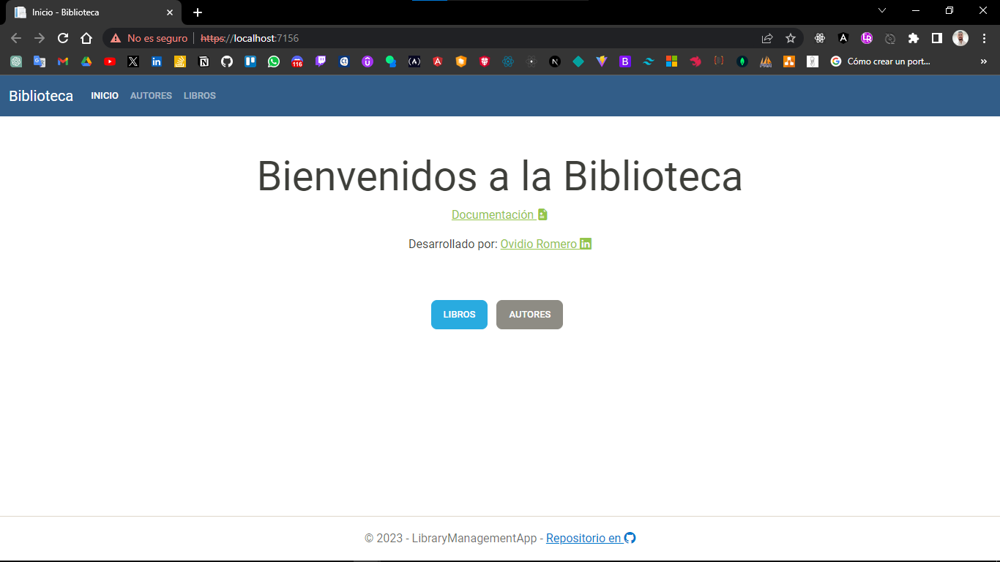
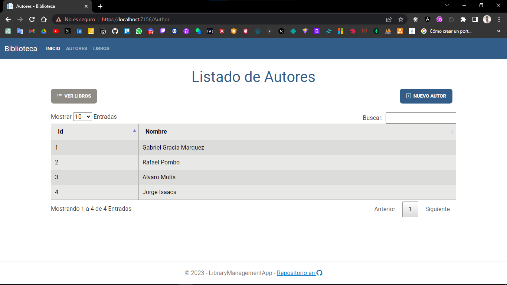
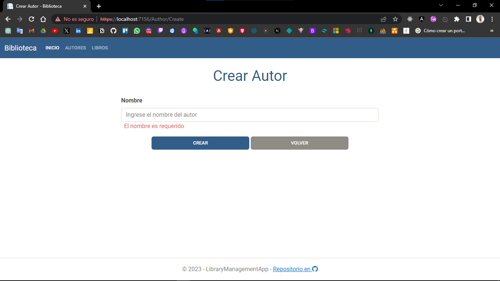
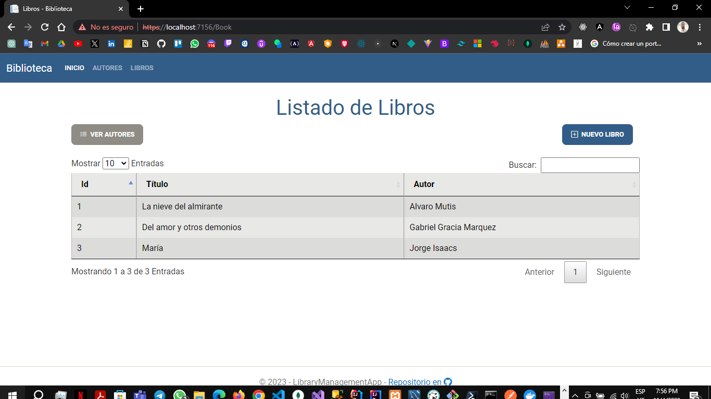
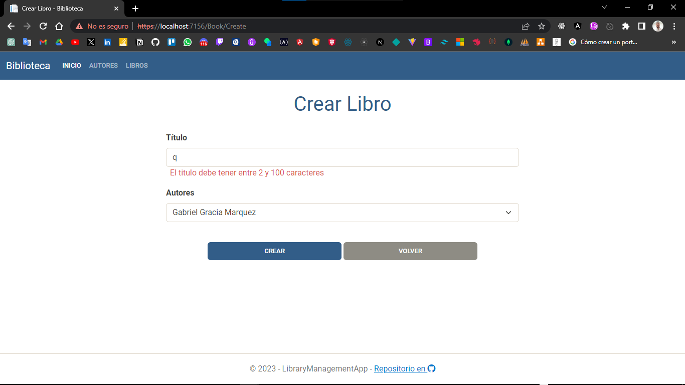
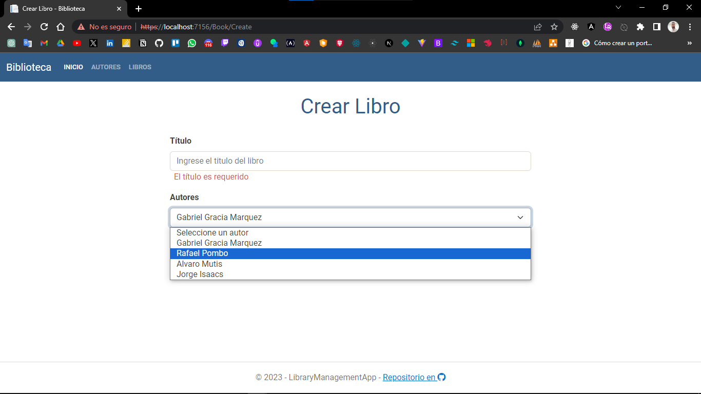
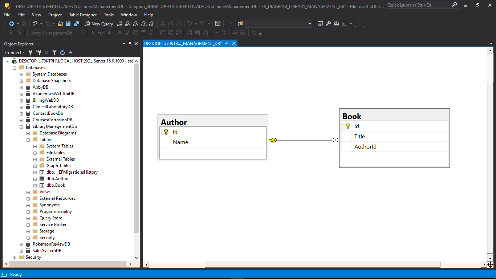

# Biblioteca Web con ASP.NET MVC

El proyecto tiene como objetivo el desarrollo de una aplicación web de gestión de biblioteca utilizando la tecnología ASP.NET MVC. Esta aplicación proporcionará a los usuarios una plataforma sencilla y eficaz para explorar, agregar y administrar libros y autores de una biblioteca virtual.

## Características Clave

- **Exploración de Libros:** Los usuarios podrán navegar a través de una amplia colección de libros disponibles en la biblioteca, ver detalles de cada libro, como título y autor;

- **Añadir Libros:** Los usuarios podrán contribuir a la biblioteca virtual añadiendo nuevos libros. Podrán ingresar detalles como título y autor;

- **Gestión de Autores:** La aplicación permitirá a los usuarios acceder a una lista de autores y explorar su obra. También podrán agregar nuevos autores a la base de datos de la biblioteca.

- **Interfaz de Usuario Intuitiva:** La aplicación estará diseñada con una interfaz de usuario intuitiva y atractiva que facilite la navegación y la gestión de libros y autores.

- **Optimización de Búsqueda:** Los usuarios podrán realizar búsquedas avanzadas para encontrar libros específicos o autores en función de diversos criterios como género, título o nombre del autor.

Este proyecto tiene como objetivo simplificar la gestión de bibliotecas, proporcionando a los amantes de la lectura una herramienta accesible para descubrir, compartir y explorar una amplia variedad de libros y autores. La tecnología ASP.NET MVC garantiza un desarrollo eficiente y una experiencia de usuario sólida.

## Instalación y Configuración

- **Descargar Git:** [Git](https://git-scm.com/downloads) escoge la version compatible para tu sistema operativo.

- **Instalar Git:** Asegurate de haber instalado git en tu maquina local ejecutando el siguiente comando en la terminal.

```
  git --version
```

- **Descargar SDK de .NET:** [SDK .NET](https://dotnet.microsoft.com/es-es/download) escoge la version compatible para tu sistema operativo.

- **Instalar >net:** Asegurate de haber instalado el SDK de .NET en tu maquina local ejecutando el siguiente comando en la terminal.

```
  dotnet --list-sdks
```

- **Descargar Repositorio:** Clona el repositorio en tu maquina local.

```
  git clone https://github.com/ROGUEANOVI/asp.net-mvc-library-management-app.git
```

- **Implementar IDE:** Abre el proyecto mediante tu IDE de prefencia para facilitar el desarrollo.

- **Configurar la Cadena de Conexión:** En el archivo de appsettings.json reemplaza la propiedad 'DefaultConnection' por los datos de Conexión de tu base de datos.

```
{
  "ConnectionStrings": {
    "DefaultConnection": "Server=DESKTOP-U70KTRH\\LOCALHOST;Database=LibraryManagementDb;Trusted_Connection=True;TrustServerCertificate=True;"
  },
}
```

- **Mapear base de datos:** Usa el enfoque Code First y las herramientas que brinda Microsoft.EntityFrameworkCore.Tools para hacer el mapeo de las clases hacia la base de datos ejecuta el siguiente comando en la 'Package Manger Cosole'

```
update-database
```

- **Ejecutar proyecto:** Por ultimo ejecuta el siguiente comando para correr el proyecto.

```
dotnet run
```

## Interfaz de la aplicación

- ## Pagina de Inicio:

  

- ## Listado de Autores:

  

- ## Crear Autor:

  

- ## Listado de Libros:

  

- ## Crear Libro:

  
  

## Diagrama Entidad Relacion



## Repositorio del Proyecto en GitHub

- [asp.net-mvc-library-management-app](https://github.com/ROGUEANOVI/asp.net-mvc-library-management-app)
